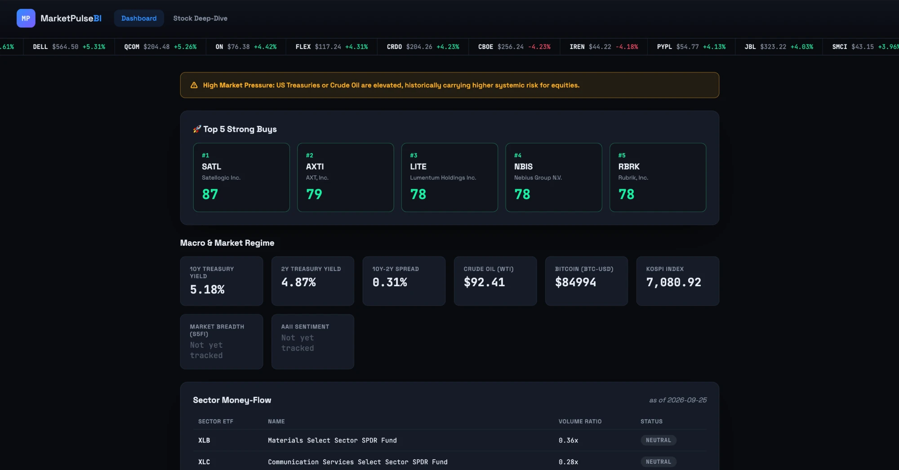
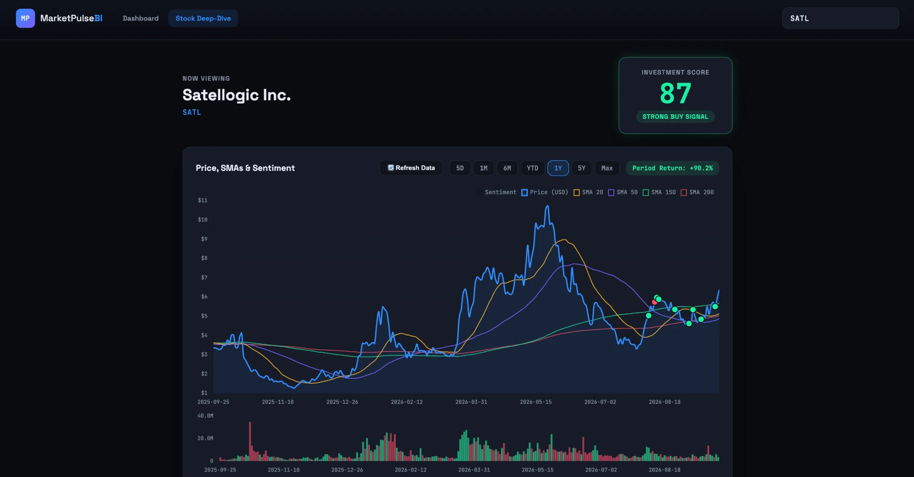
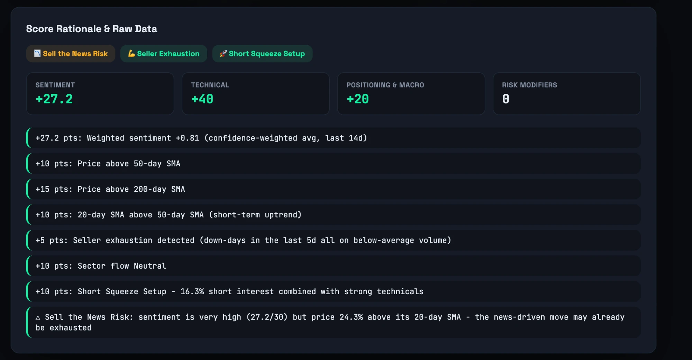
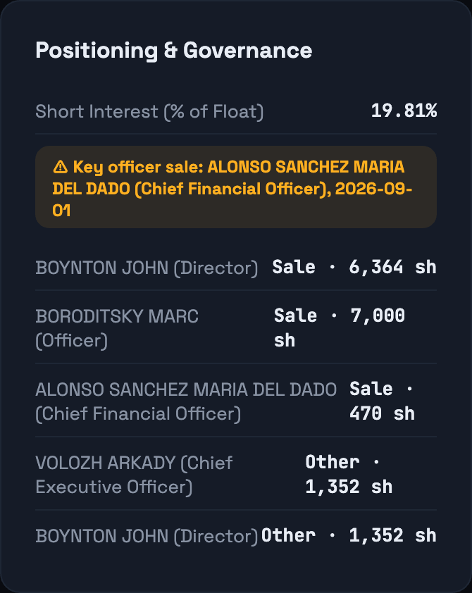
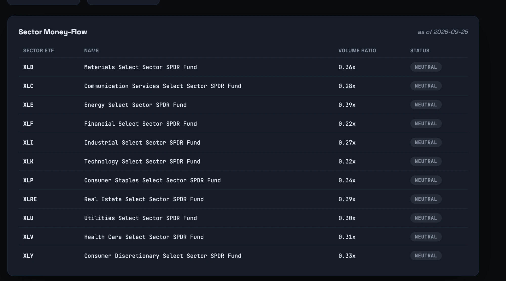
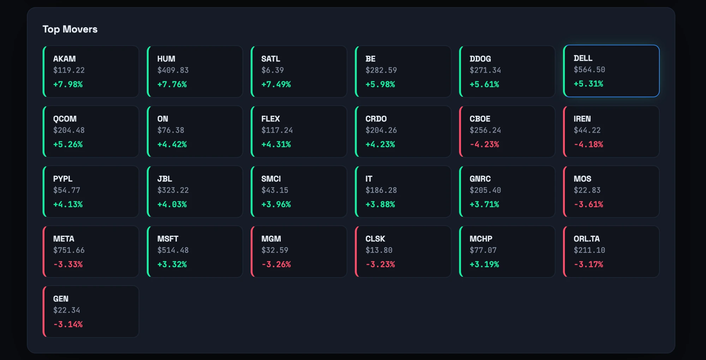
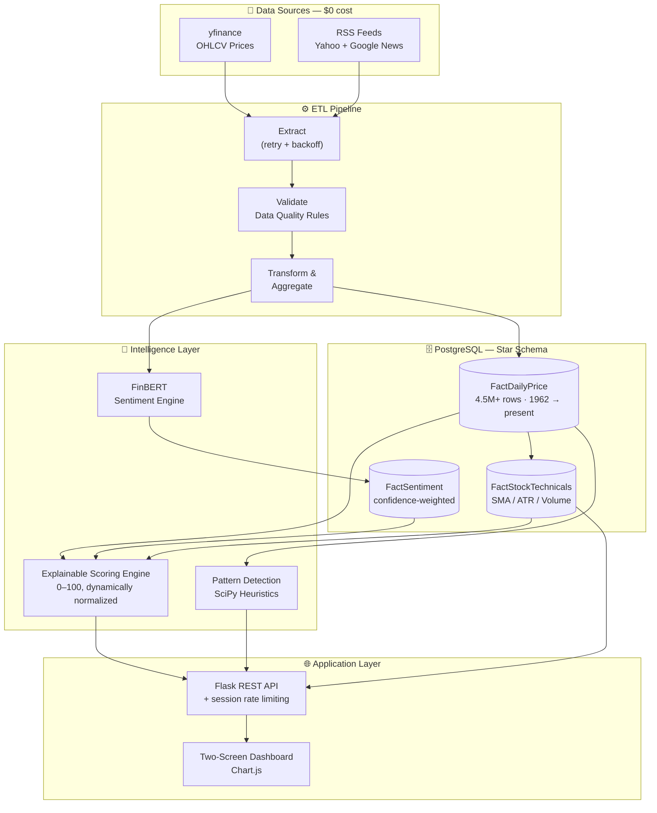
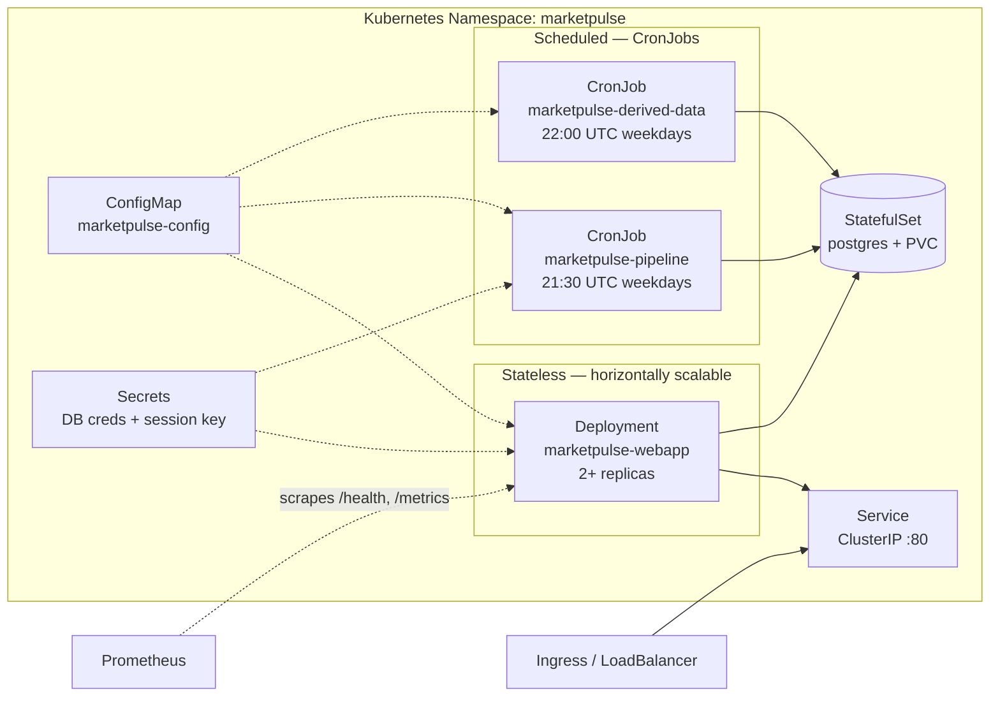

# MarketPulse BI

### An AI-Powered Financial Decision Support System

*Sentiment-aware, explainable stock scoring — built on a self-hosted data pipeline processing 4.5M+ historical price points across 560 tickers, at $0 infrastructure cost.*

[](https://www.python.org/)
[](https://flask.palletsprojects.com/)
[](https://www.postgresql.org/)
[](https://www.sqlalchemy.org/)
[](https://huggingface.co/ProsusAI/finbert)
[](https://www.chartjs.org/)
[](#testing)
[](#data-engineering-at-scale)

---

## Philosophy

Retail investors don't lack data — they lack **synthesis**. Institutional desks fuse price action, breaking news, sector rotation, insider activity, and short-interest positioning into a single call in seconds; everyone else is left context-switching between six browser tabs.

MarketPulse BI is a **decision support system**, not a trading bot. It doesn't predict prices or execute trades — it does the tedious cross-referencing a human analyst would do, transparently, and hands back a single 0–100 score **with its full reasoning attached**. Every point is traceable to a named rule. Nothing is a black box.

---

## Screenshots

| Market Dashboard | Stock Deep-Dive |
|---|---|
|  |  |
| Macro regime (10Y/2Y yields, WTI crude), sector money-flow across all 11 SPDRs, and a top-movers grid — the morning-briefing view. | Price chart with SMA overlays, a volume sub-chart, and sentiment plotted as event markers rather than a noisy bar axis. |

| Score Rationale Panel | Positioning & Governance |
|---|---|
|  |  |
| The full audit trail behind the Investment Score — every rule that fired, in plain English, with its point contribution. | Short interest, insider Form 4 filings, and a flagged CEO/CFO sale — the governance signals a fundamentals desk would check by hand. |

### Market Intelligence, Not Just a Stock Screener

| Sector Money-Flow | Top Movers |
|---|---|
|  |  |
| Accumulation/Distribution/Neutral status for all 11 sector SPDRs, ranked by volume ratio — where institutional money is rotating *today*. | The day's largest movers across the full watchlist, ranked by absolute % change, color-coded and one click from a full deep-dive. |

---

## Architecture



**Star schema**: `DimAsset`, `DimDate`, `FactDailyPrice`, `FactSentiment`, `FactStockTechnicals`, `FactSectorVolume`, `MacroIndicators`, plus governance tables (`InsiderTransactions`, `StockEnrichmentCache`) and operational logging (`PipelineExecutionLog`, `DataQualityResults`). Full column-level definitions in [`db/migrations/`](db/migrations/).

---

## Core Features

### 🧮 Explainable AI Scoring — not a black box

Every Investment Score is built from four named, weighted buckets that sum to exactly 100 in the maximally-bullish case:

| Bucket | Range | Signal |
|---|---|---|
| **Sentiment** | 0 → 30 | Confidence-weighted FinBERT average over the trailing 14 days |
| **Technical** | 0 → 40 | Price vs. SMA-50/200, SMA-20 > SMA-50 crossover, Seller-Exhaustion bonus |
| **Positioning & Macro** | −10 → 30 | Sector money-flow (Accumulation/Distribution) + a dynamic Short-Interest rule |
| **Risk Modifiers** | −30 → 0 | ATR volatility penalty, CEO/CFO insider-selling penalty (90-day lookback) |

**Dynamic Normalization**: most tickers have no recent news at all — without a fix, that structurally caps their score at 70 and makes "Strong Buy" nearly unreachable for the majority of the universe. When there's no scored sentiment in the window, the Technical + Positioning base is rescaled from its 70-point ceiling up to a full /100 *before* risk modifiers are applied — so a thin news cycle no longer silently punishes a stock's ceiling.

Every rule that fires — bonus or penalty — appends a line to a live audit trail:

```
+15 pts: Price above 200-day SMA
+10 pts: 20-day SMA above 50-day SMA (short-term uptrend)
+5 pts:  Seller exhaustion detected (down-days on below-average volume)
-20 pts: CEO/CFO insider selling in the last 90 days
Score normalized: no recent news, so the 25.0/70-point base is scaled to /100 (35.7)
```

A **"Sell the News Risk"** flag layers on top, purely informational: it fires when sentiment is very high *and* the stock is already technically overextended (price >10% above its 20-day SMA, or volume climaxing) — a warning that a news-driven pop may already be exhausted, without touching the score itself.

### 📊 Data Engineering at Scale

- **560 tickers** — a curated personal watchlist merged with the full S&P 500 constituent list (scraped live from Wikipedia) and all 11 Sector SPDR ETFs.
- **4.5M+ price rows**, backfilled with `yfinance`'s full `period=max` history — some tickers reach back to **1962**.
- Idempotent upserts throughout (`ON CONFLICT` keyed on natural keys) — the entire pipeline can be re-run against the same day's data with zero duplication.
- A confirmed, measured performance fix: the dashboard's "Top Movers" query dropped from **~1.85s to ~90ms** by filtering to a recent date window *before* applying a window function, instead of scanning the full multi-million-row table on every page load.
- Exchange-aware data hygiene: yfinance returns phantom stale-close rows for non-U.S. markets on days the source calendar doesn't recognize as holidays (e.g. the Tel Aviv Stock Exchange's Friday/Saturday weekend) — these are filtered at ingestion so they can't quietly dilute rolling volume/volatility averages.

### 🔄 Live Refresh & Session-Scoped Rate Limiting

A "Refresh Data" button on the deep-dive screen triggers an on-demand, single-ticker re-fetch (price, news, technicals) — deliberately scoped to just that ticker, not a full pipeline run. Protected by an in-session rate limiter:

- **5 refreshes per rolling hour**, tracked per browser session via a signed cookie — no database table, no user accounts, no external dependency.
- A clean `429` response with a human-readable retry estimate when the budget is exhausted, surfaced in the UI as a dismissible warning rather than a broken button.

### 🔍 Heuristic Pattern Detection

A lightweight `scipy.signal.find_peaks`-based module scans recent price action for two classic chart silhouettes:

- **Head and Shoulders** — three peaks with a taller middle peak and near-symmetric shoulders.
- **Cup and Handle** — a rounded recovery back near a prior high, followed by a shallow pullback.

These render as a dashed "Technical Observation" badge — a nudge to look closer in a real charting tool, **never a scoring input**. This separation is deliberate and enforced by tests: the Investment Score is verified byte-for-byte identical whether or not a pattern hint fires.

---

## Tech Stack

| Layer | Technology |
|---|---|
| Language | Python 3.11 |
| Web Framework | Flask 3.0 |
| Database | PostgreSQL 16 (star schema, via SQLAlchemy 2.0) |
| NLP | FinBERT (`ProsusAI/finbert`, via 🤗 Transformers + PyTorch) |
| Market Data | `yfinance` |
| News | Yahoo Finance & Google News RSS (`feedparser`) |
| Scientific Computing | `scipy`, `pandas`, `numpy` |
| Frontend | Vanilla JS + Chart.js (no build step) |
| Testing | `pytest` |
| Containerization *(written, not yet deployed)* | Docker, Kubernetes |

---

## Getting Started

### Prerequisites

- Python 3.11+ (newer `yfinance` needs `curl_cffi`, which has no wheels for 3.9)
- PostgreSQL 16 running locally (`brew install postgresql@16` on macOS)

### 1. Clone & set up the environment

```bash
git clone https://github.com/Liormym/MarketPulse-BI.git
cd MarketPulse-BI

python3.11 -m venv .venv
source .venv/bin/activate
pip install -r requirements.txt

cp .env.example .env   # edit if your local Postgres credentials differ
```

### 2. Initialize the database

```bash
python scripts/apply_migrations.py     # versioned schema, tracked in schema_migrations
python scripts/seed_dimensions.py      # DimDate + DimAsset from config/watchlist.yaml
```

### 3. (Optional) Expand to the full S&P 500 universe

```bash
python scripts/fetch_sp500_constituents.py   # merges the S&P 500 into the watchlist
python scripts/seed_dimensions.py            # re-seed with the expanded list
```

### 4. Backfill historical data

```bash
# Full available history (recommended — powers the 5Y/Max chart views)
PYTHONPATH=src python scripts/backfill_historical_prices.py --period max

# Derived tables, computed from the price history you just pulled (no new API calls)
PYTHONPATH=src python scripts/compute_stock_technicals.py
PYTHONPATH=src python scripts/compute_sector_flows.py
PYTHONPATH=src python scripts/fetch_macro_indicators.py
```

> First run downloads the FinBERT model (~440MB) from Hugging Face; later runs reuse the cached weights.

### 5. Run the data pipeline (prices, news, sentiment)

```bash
PYTHONPATH=src python -m marketpulse.pipeline
```

### 6. Launch the web app

```bash
python webapp/app.py
```

Visit **http://localhost:5050** — the Market Dashboard loads at `/`, and any ticker's deep-dive view is at `/stock/<TICKER>`.

---

## Daily Automation (End-of-Day Pipeline)

A quantitative system is only as trustworthy as its most stale input. Sector flows, technicals, and Investment Scores all depend on the day's price data being fresh — if any one of those steps runs out of order, or on its own schedule disconnected from the others, the dashboard can end up telling two different stories about "today" (exactly what the freshness badges in the Macro and Sector panels are designed to catch).

`scripts/run_daily_update.py` is the single entry point that runs the full refresh in the dependency order that actually matters:

1. **Fetch macro indicators** (`fetch_macro_indicators.py`) — yields, oil, Bitcoin, KOSPI, S&P 500, NASDAQ, RSP
2. **Fetch fresh prices, news & sentiment** (`python -m marketpulse.pipeline`) — the trailing-window daily pipeline, not the one-time full backfill
3. **Recompute technicals** (`compute_stock_technicals.py`) — SMA/ATR/gap, from step 2's prices
4. **Compute sector flows** (`compute_sector_flows.py`) — Accumulation/Distribution/Neutral, from step 2's prices
5. **Compute Investment Scores** (`compute_investment_scores.py`) — from steps 2–4's output

It stops at the first failing step rather than pressing on with partial data:

```bash
PYTHONPATH=src python scripts/run_daily_update.py
```

### Running it automatically

`scripts/scheduler.py` is a small `schedule`-based daemon that triggers the update above at **23:10** every US market weekday (30 minutes after the market close CronJob window used elsewhere in this repo). Each firing runs the orchestrator as a subprocess, so a failed pipeline run can't crash the daemon itself — it just logs the failure and waits for the next weekday.

Start it in the background and leave it running (e.g. in `tmux`/`screen`, or with `nohup`):

```bash
# tmux (recommended for a dev machine you keep logged into)
tmux new -s marketpulse-scheduler
PYTHONPATH=src python scripts/scheduler.py
# detach with Ctrl+B then D; reattach later with: tmux attach -t marketpulse-scheduler

# or nohup, if you'd rather not use tmux
PYTHONPATH=src nohup python scripts/scheduler.py > scheduler.log 2>&1 &
```

**For a production deployment, prefer `cron` (or the `k8s/pipeline-cronjob.yaml` CronJob already in this repo) over a long-lived Python daemon** — a scheduler process is one more thing that can silently die on a dev machine. The equivalent crontab entry:

```cron
10 23 * * 1-5 cd /path/to/MarketPulseAI && PYTHONPATH=src /path/to/.venv/bin/python scripts/run_daily_update.py >> /var/log/marketpulse-eod.log 2>&1
```

`10 23 * * 1-5` reads as: minute 10, hour 23, every day-of-month, every month, weekdays 1–5 (Monday–Friday) — the same schedule `scheduler.py` runs on.

---

## Testing

```bash
PYTHONPATH=src pytest
```

74 tests covering the scoring engine (every rule in isolation, plus fuzz-tested bounds), the sentiment pipeline, technical indicator math, pattern detection heuristics, the rate limiter, and idempotent-upsert integration tests against a real local Postgres instance.

---

## Repository Layout

```
src/marketpulse/       Core pipeline & domain logic
├── extract/            yfinance + RSS ingestion
├── sentiment/           FinBERT scoring
├── load/                 Idempotent upserts
├── scoring.py             Explainable Investment Score engine
├── technicals.py           SMA / ATR / volume computation
├── sector_flow.py            Sector Accumulation/Distribution classification
├── pattern_detection.py       SciPy chart-pattern heuristics
└── live_refresh.py             On-demand single-ticker refresh

webapp/                 Flask application
├── app.py               Routes & API
├── db.py                 Query layer
├── rate_limit.py           Session-scoped rate limiter
├── templates/                Dashboard & deep-dive HTML
└── static/                    CSS + Chart.js frontend

db/migrations/          Versioned SQL schema
scripts/                 One-off backfills, computations, data fixes,
                          and the daily EOD orchestrator + scheduler
tests/                    pytest suite
config/watchlist.yaml     The 560-ticker universe
```

---

## Cloud Architecture & Kubernetes Deployment

MarketPulse runs happily on a laptop, but nothing about its design is laptop-specific. Every component maps cleanly onto a standard Kubernetes workload type, and the manifests in [`k8s/`](k8s/) are real, reviewed artifacts — not aspirational diagrams. (They're not yet applied to a live cluster here, simply because Docker Desktop/minikube aren't installed on this dev machine — see [`docker-compose.yml`](docker-compose.yml) for the local container equivalent in the meantime.)



### The Flask API is a stateless `Deployment`

The rate limiter's state lives in a **signed session cookie on the client**, not in server memory (`webapp/rate_limit.py`) — so there's no sticky-session requirement, no shared cache, no leader election. Scaling from 1 replica to N is just `replicas: N` ([`k8s/webapp-deployment.yaml`](k8s/webapp-deployment.yaml)). It ships with two Kubernetes-native health checks (`webapp/app.py`):

- **`/health`** — liveness. Never touches Postgres, so a slow/unreachable database doesn't trigger a restart-loop of otherwise-healthy pods.
- **`/health/ready`** — readiness. Runs a trivial query, so a pod that *can't* reach Postgres stops receiving traffic without being killed.

### The ETL pipeline and derived-data jobs map to `CronJobs`

| Workload | Kubernetes Kind | Schedule | Why |
|---|---|---|---|
| `marketpulse.pipeline` (prices, news, sentiment) | `CronJob` → `Job` → `Pod` | `30 21 * * 1-5` (after US market close) | Recurring, idempotent, naturally batch |
| Derived data (technicals, sector flow, macro) | `CronJob` | `0 22 * * 1-5` (30 min after the pipeline) | Depends on that day's fresh prices/sentiment — scheduled after it, never racing it |
| `period=max` historical backfill, S&P 500 constituent refresh | one-shot `Job` (`kubectl create job --from=cronjob/...`) | On-demand | These are onboarding/rebalancing operations, not a recurring schedule — modeled honestly as one-time Jobs rather than forced into a CronJob that would mostly no-op |

Every write path (`ON CONFLICT` upserts throughout) is safe to re-run, which is precisely what makes the `CronJob → Job → Pod` model viable in the first place — a missed or doubled run on a flaky node is a non-event.

### Configuration: `ConfigMaps` and `Secrets`, kept strictly separate

[`k8s/configmap.yaml`](k8s/configmap.yaml) holds everything safe to read in plaintext (watchlist path, request throttling, the FinBERT model id, DB host/port). [`k8s/secrets.example.yaml`](k8s/secrets.example.yaml) holds exactly two things: DB credentials and the Flask session-signing key — nothing else ever lives there. Every workload composes both via `envFrom`, so adding a new non-secret setting never means editing three YAML files.

### Built for observability

- **Structured operational logging today**: every pipeline run's stage-by-stage status and every data-quality check result land in `PipelineExecutionLog` / `DataQualityResults` (queryable directly — no external tool required to see if last night's run succeeded).
- **Kubernetes-native health surface today**: `/health` and `/health/ready` are exactly what a Prometheus `kubernetes_sd_config` or a standard liveness/readiness probe expects out of the box — no adapter needed.
- **Ready for a metrics sidecar**: the architecture doesn't fight a `postgres_exporter` (StatefulSet) or a Flask Prometheus middleware (Deployment) — both are additive, drop-in containers/decorators, not a redesign. Grafana dashboards over pipeline duration, DQ pass rate, and API latency are a natural next step once there's a cluster to point them at.

### Bringing it up

```bash
kubectl apply -f k8s/00-namespace.yaml
kubectl apply -f k8s/configmap.yaml
kubectl apply -f k8s/secrets.yaml            # copy from secrets.example.yaml first, never commit the real one
kubectl apply -f k8s/postgres-statefulset.yaml
kubectl apply -f k8s/pipeline-cronjob.yaml
kubectl apply -f k8s/derived-data-cronjob.yaml
kubectl apply -f k8s/webapp-deployment.yaml
```

---

## Out of Scope

No algorithmic trading, no real-time streaming (batch/on-demand only), no Kafka/Spark, no FinBERT fine-tuning, no cloud spend — the entire system runs locally at **$0** infrastructure cost.

---

<p align="center"><sub>Built as an end-to-end data engineering + applied ML portfolio project.</sub></p>
